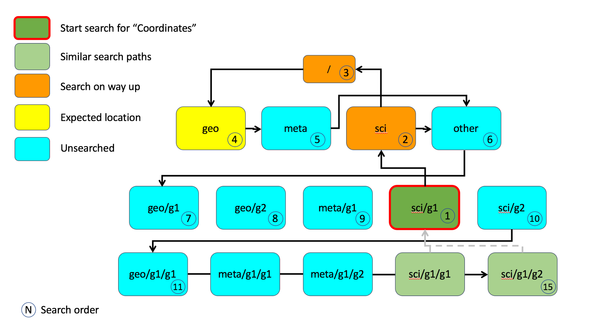

= CF2-Group: Draft Extension for Files with Groups
Charlie Zender, Daniel Lee
:toc: left
:toclevels: 4
:sectnums:
:icons: font
:linkattrs:
:data-uri:
:source-highlighter: pygments

// Authors (>= 1 paragraph contribution) : Charlie Zender, Daniel Lee...
//         Contributors (Comment, minor edits, < 1 paragraph): , ...

== Summary

This documents proposes "CF2" Conventions called CF2-Group to support files with groups. Group files are those which utilize the "group" features of the Common Data Model (CDM) as implemented in netCDF4. Such files can contain hierarchical directory-like structures not possible with the single, flat namespace described by CF1.

Files indicate adherence to CF2-Group with a `Conventions` attribute that includes the string `"CF2-Group-1.X"`, where X is the latest CF2-Group sub-release.

Design Principles:

. CF2-Group conventions for hierarchical files do not affect, alter, or require changes in CF1 metadata annotation of flat files. Thus CF2-Group is backwards compatible when applied to flat (classic or "netCDF3") files.

. CF2-Group hierarchical files adhere, when appropriate, to CF1 conventions within each group. Moreover, CF2-Group files can map to a set of  CF1 files as described in Appendix 1. This allows CF2-Group files to be used (after "flattening" or "dismemberment") with some software aware of only CF1.

. CF2-Group files are amenable and robust to sub-setting and aggregation. CF2-Group exploits organizational rules of group hierarchies including scoping and inheritance of ancestor properties. Thus CF2-Group files need not include any absolute pathnames to coordinates, dimensions, and attributes.

== Attributes

CF2-Group distinguishes between Global and Group attributes.

A Global Attribute is any standalone attribute (i.e., not attached to a variable) in the root group. Global Attributes have file scope. These netCDF attributes are considered Global Attributes, and as such should only exist in the root group:

* `title`
* `history`
* `Conventions`

Group Attributes are any non-global attributes that are not attached to a variable. They apply to the group where they are defined and to that group's descendents, but not to ancestor or sibling groups. Group Attributes apply to all of that group's descendents recursively with an exception: Any group may redefine an attribute defined in an ancestor group, and that child group's definition applies to all its descendents. Thus in cases where multiple ancestor groups define the same attribute, attribute values are inherited from the nearest ancestor. These are the same scoping properties as dimensions in the extended Common Data Model (e.g., as implemented in netCDF4) and in many programming languages.

== Glossary

*Most proximal identifier -*

*Referring group -*

*Out of group reference -*

*Local apex group -*

== Best Practices

. CF2 Group files may contain all netCDF4 atomic types, though not the netCDF4 "non-atomic" types. Atomic types are the netCDF Classic types, plus the newer netCDF4 integer types (`ubyte`, `ushort`, `uint`, `uint64`, `int64`), and strings. These types are all first-class citizens in CF2-Group. The newer netCDF4 atomic types can be converted to a netCDF Classic type when necessary, though the conversion may lose information and/or range when the data exceed the bounds of the smaller type. netCDF4 Extended files can also contain "non-atomic" types, including enumerated (`enum_t`), variable length (`vlen_t`), opaque, compound, and user-defined types. These non-atomic types are more difficult to approximate with the Classic data model, and should be avoided entirely when CF1-compliance is important. It is anticipated that future versions of CF2 Group will allow some non-atomic types, as the ecosystem of tools and services evolves to accommodate them.

. The use of Group Attributes to store metadata normally attached directly to variables is discouraged. This includes, for example, replacing per-variable attributes like `_FillValue`, `scale_factor`, `valid_min`, with group-level equivalents. Although group attributes might be more concise, it is likely to create problems with downstream software and reduce interoperability.

. Any metadata content embedded in a group name must be redundantly stored in a group attribute so that moving or renaming the group does not result in information loss. Each group's attributes, dimensions and variables should be self-contained in combination with the group metadata and any inherited properties (e.g., dimension sizes, coordinates). This ensures that if a group is renamed or extracted (with any inherited properties) into a new file, its information content is preserved. For example, storage of ensembles as sibling groups (as described below) is often clearer when the realization number is encoded in the group name. In this case, the `Realization` group attribute retains the realization number even if the group is renamed. Other commonly enumerated group names, such as station identifiers, buoy numbers, or channel wavelengths are analogous. It is fine to enumerate or itemize names so long as the number or name is redundantly stored as a group attribute.

. Renaming or moving a group or self-contained branch of groups to a new location should not affect the interpretation of data. Since relative and absolute paths (containing "/") of coordinates, dimensions, and attributes are fragile, it is preferred they not be present in attributes. Instead, named objects resolve to the most proximal object (i.e., dimension or variable) of that name that has the referring attribute within its scope (heritable domain). This makes CF2-Group files amenable to sub-setting and aggregation. For example, the CF `coordinates` attribute identifies a variable's coordinates in a whitespace-separated list such as `"lat lon"`. When the coordinates are outside the group that contains the `coordinates` attribute, it is tempting to store the coordinate locations as full, unambiguous paths such as `"/g1/lat /g1/lon"`, or as relative paths such as `"g1/lat g1/lon"`. However, paths that contain slashes must be explicitly altered when the variable is subset into a new file with a different group hierarchy, or when the hierarchy is flattened. CF attributes affected by this practice include `ancillary_variables`, `bounds`, `cell_measures`, `climatology`,  `coordinates`, `formula_terms`, and `grid_mapping`. The simpler `"lat lon"` specification works without alteration in all situations for out-of-group locations so long as it is understood to mean the nearest identifiers that have the referring variable in their scope. Utilizing scope in preference to absolute and relative paths is a best practice, and is not a requirement of CF2-Group. It is legal to identify out-of-group variables by an absolute or relative path.

== Scope

Scope is a fundamental characteristic of group hierarchies and should be utilized, not circumvented, by employing absolute or relative paths. Tools that work well with such CF2-Group files must implement these CF2-Group rules that define scope in order to find the most proximal named object within a scope. The three scoping rules below are presented in the order in which an algorithm would search for an identified object, i.e., first via an absolute path, next via a relative path, or finally a search for the most proximal object matching a name with no path.

. An identifier specified with an absolute path (i.e., with a leading slash "/") resolves to the indicated location. For example, a `coordinates` attribute of `/g1/lat` refers to the `lat` variable in group `/g1`. The dataset producer must ensure that dimension(s) utilized by out-of-group objects are the same as those used by the referring object. For example, the nearest dimension `lat` to the current (referring) group must be the same as the dimension `lat` nearest in scope to the out-of-group coordinates. Thus a variable `/g2/temperature` with coordinates attribute containing `/g1/lat` is permissible so long as there is no other lat dimension "in between" those locations, e.g., `/lat`.

. An identifier specified with a relative path (i.e., with an internal but no leading slash "/") resolves to the indicated location.  For example, a `coordinates` attribute of `g1/lat` refers to the `lat` variable in subgroup `g1` of the current (referring) group. Upward path traversals from the current group are indicated with the UNIX convention. For example, `../g1/lat` refers to the `lat` variable in the sibling group `g1` of the current (referring) group.

. An identifier specified with no path resolves to the most proximal identifier of the same name. In all cases if the named object is present in the referring group then that object is the most proximal. For example, a `coordinates` attribute of `lat` refers to the `lat` variable (if any) in the present group. If the object is not in the referring group then the identifier is termed an "out-of-group" reference. The algorithm that defines the most proximal object for an out-of-group reference is type-specific:

.. Groups: The most proximal group to a given group arises as a search problem when a location is specified with a relative pathname, e.g., the `coordinates` attribute includes `g1/v1`. The resolution of the relative pathname is described above in item 2.

.. Dimensions: We know of no case where a CF attribute explicitly refers to a dimension by its name. Instead CF relies on coordinates that implicitly identify particular dimensions or groups of dimensions. A reference to an out-of-group dimension shall be resolved by a direct ancestor search, starting with the parent group and proceeding upward. The first dimension found with the given name is the most proximal. This algorithm is the same as that implemented for dimension inheritance by the netCDF4 data model (i.e., the CDM).

. Coordinates: Like dimensions, the most proximal coordinate of a given name shall be searched for using a direct ancestor search beginning with the parent group and proceeding upward. Unlike dimensions, the search must continue if the named coordinate has not been found in any direct ancestor. The coordinate variable must reside in the scope of the dimension(s) it contains, and these dimensions must be the same as those in the variable whose attribute contains the reference. These dimensions may be defined in any direct ancestor of the referring group. The direct ancestor search continues until reaching the local apex group. The local apex is the nearest ancestor group in which any of the dimension(s) underlying the named coordinate is first defined. If the coordinate itself has not yet been found, then the coordinate search proceeds in a width-wise fashion downwards from the apex group through each level of groups.
+
For example, a `coordinates` attribute of `lat` is first searched for in the referring group, then its direct ancestor groups beginning with its parent group. If no variable named `lat` is found in the direct ancestors before the dimension `lat` is found, then the search continues as a width-wise search level-by-level through the group hierarchy starting at the local apex group (where the dimension `lat` is defined) and searching the siblings in each level in left-to-right order. For example, NASA products often define out-of-group dimensions at the root level and out-of-group coordinates are stored in a sibling group (e.g., `Geolocation`) to the parent group (e.g., `Science_Data`)  of the variable containing the reference. This scoping algorithm, a direct-ancestor followed by width-wise search from the apex group, is illustrated in <<alg_cf2_oog>>.

[[alg_cf2_oog,{figure-caption} {counter:figure-num}]]
.Demonstration of search algorithm to locate most proximal out-of-group coordinate. The referring group `sci/g1` contains a variable with a `coordinates` attribute with value `"lat lon"`, say. The precedence of each group in the hierarchy beneath the apex group is indicated by the circled number, beginning with the referring group which has the highest precedence. If a coordinate variable is not found in the referring group, and it is not specified by a relative or absolute path, then a direct-ancestor followed by width-wise search is performed. The search proceeds up through each direct ancestor until the apex group (where the dimension is defined) is reached. If a coordinate is not found among the direct ancestors, then a width-wise search is performed level-by-level through the hierarchy. Here the width-wise search commences with the `/geo` group. NASA datasets often separate geolocation coordinates from science data, and store coordinates in a sibling group to the science data as shown.

== Use cases

=== Collections

Group datasets are well-suited when users might benefit from storing related datasets (collections of variables) in a single location (file). Loose collections might comprise different sets of distinct variables with a common purpose, e.g., multiple sensor observations at a single location. For example, a model and satellite retrieval of a temperature field might be combined with an in situ temperature sensor as follows:

----
netcdf clc {
  :Conventions = "CF-1.5 CF2-Group";
  :history = "Tue Apr 25 12:46:10 PDT 2017: ncgen -k netCDF-4 -b -o ~/nco/data/clc.nc ~/nco/data/clc.cdl";
  :Purpose = "Demonstrate a collection of related datasets stored in hierarchical format";

  group: model {
  :Source = "Model simulations, e.g., of temperature";
  dimensions:
  lat=2;
  lon=3;
  time=unlimited;
  variables:
  float temperature(time,lat,lon);
  double time(time); // Variable attributes omitted for clarity
  double lat(lat);
  double lon(lon);
  data:
  lat=-90,90.;
  lon=0.,120.,240.;
  temperature=273.,273.,273.,273.,273.,273.;
  time=1.;
  } // end model

  group: measurements_remote_sensing {
  :Source = "Satellite measurements of same region as modelled, and on a different spatio-temporal grid";
  dimensions:
  lat=3;
  lon=4;
  time=unlimited;
  variables:
  float temperature(time,lat,lon);
  double time(time); // Variable attributes omitted for clarity
  double lat(lat);
  double lon(lon);
  data:
  lat=-90,0.,90.;
  lon=0.,90.,180.,270.;
  temperature=273.,273.,273.,273.,273.,273.,273.,273.,273.,273.,273.,273.;
  time=1.;
  } // end measurements_remote_sensing

  group: measurements_in_situ {
  :Source = "In situ measurements, e.g., from an automated weather station with its own time-frequency";
  dimensions:
  time=unlimited;
  variables:
  float temperature_10m(time);
  double time(time); // Variable attributes omitted for clarity
  data:
  temperature_10m=271,272,273,274;
  time=1.,2.,3.,4.;
  } // end measurements_in_situ

} // end root group
----

The namespace separation provided by groups allows variable and dimension names to be re-used and axes lengths to be re-defined. In this example two groups contain a `temperature` variable, and the third contains a temperature at 10 m height. Each group has its own spatio-temporal grid that re-uses the same coordinate names (`lat`, `lon`, `time`) as the other groups without conflict. While this collection illustrated how group files may be used as "data suitcases" for organizing a small number of related datasets into a single level of groups, the next examples leverage groups in more powerful ways including potentially large ensembles and deep hierarchies.

=== Ensembles

Geoscientists use the label "ensemble" for collections of realizations of individual models or measurements of the same phenomena. It is particularly important for models to repeat simulations of nonlinear systems multiple times (with slightly perturbed initial conditions) in order to characterize the statistical properties of systems with internal variability. The namespace separation provided by groups ensures that variable names can be re-used. Axis lengths can be re-defined if distinct realizations employ different spatio-temporal resolutions. Multiple realizations of a single model temperature field might be stored as:

----
netcdf nsm {
  :Conventions = "CF-1.5 CF2-Group";
  :history = "Tue Apr 25 12:46:10 PDT 2017: ncgen -k netCDF-4 -b -o ~/nco/data/clc.nc ~/nco/data/clc.cdl";
  :Purpose = "Demonstrate a model ensemble stored in hierarchical format";

  group: cesm_01 {
      :Scenario = "Historical";
      :Model = "CESM";
      :Realization = "1";

    dimensions:
      time=unlimited;
    variables:
      float temperature(time);
      double time(time);
    data:
      temperature=272.1,272.1,272.1,272.1;
      time=1.,2.,3.,4.;
    } // cesm_01

  group: cesm_02 {
      :Scenario = "Historical";
      :Model = "CESM";
      :Realization = "2";

    dimensions:
      time=unlimited;
    variables:
      float temperature(time);
      double time(time);
    data:
      temperature=272.2,272.2,272.2,272.2;
      time=1.,2.,3.,4.;
    } // cesm_02

  group: cesm_03 {
      :Scenario = "Historical";
      :Model = "CESM";
      :Realization = "3";

    dimensions:
      time=unlimited;
    variables:
      float temperature(time);
      double time(time);
    data:
      temperature=272.3,272.3,272.3,272.3;
      time=1.,2.,3.,4.;
    } // cesm_03

} // root group
----

Here each group contains a different realization of the same model, and the group names are suffixed with a numerical identifier, as well as containing a numerically valued Group Attribute named `Realization`. This attribute would be carried with its group should the group ever be renamed or extracted into a new file, thus preserving the identity of the original realization. CF2-Group allows including numeric metadata in group names so long as the information is redundantly stored as group metadata (e.g., `Realization`). To accommodate the potential need of downstream software to deconstruct a number-containing group name into its original components it is suggested that the numeric portion be encoded as a fixed-width string separated by a non-alphanumeric character, such as "`_03`" above.

=== Discrete Sampling Geometries

CF1 describes a powerful syntax for encoding spatiotemporal data from multiple locations into multidimensional flat-file formats. The patterns of the spatiotemporal data are encapsulated into several features, each labeled with a distinct `featureType` that must be either `point`, `timeSeries`, `profile`, `trajectory`, `timeSeriesProfile`, or `trajectoryProfile`. These features use an instance dimension to span a collection of like features. One-dimensional variables that have only the instance dimension in a Discrete Geometry CF file are called instance variables. Common instance variables include `lat(station)` and `station_name(station, name_len)`. Here the `station` dimension enumerates the stations in the collection.

CF2-Group recommends using an extended form of CF1 features where groups replace the instance dimension in Discrete Sampling Geometries. Instead of a `station` dimension, CF2-Group feature collections may designate a group to contain the feature for each station. Typically the group name would be the same as the CF1 `station_name`. A `timeSeries` collection might appear like this in a CF2-Group file:

----
netcdf tms {
  :Conventions = "CF-1.5 CF2-Group";
  :history = "Thu Jun 22 17:45:12 PDT 2017: ncgen -k netCDF-4 -b -o ~/nco/data/tms.nc ~/nco/data/tms.cdl";
  :Purpose = "Demonstrate a collection of DSG timeSeries featureType stored in hierarchical format";
  :featureType = "timeSeries";

dimensions:
  time=unlimited;

variables:

  double time(time) ;
  time:standard_name = "time";
  time:long_name = "time of measurement" ;
  time:units = "days since 1970-01-01 00:00:00" ;

group: irvine {

  variables:

    float humidity(time) ;
  humidity:standard_name = "specific humidity" ;
  humidity:coordinates = "lat lon alt station_name" ;
  humidity:_FillValue = -999.9f;

    float lon ;
  lon:standard_name = "longitude";
  lon:long_name = "station longitude";
  lon:units = "degrees_east";

    float lat ;
  lat:standard_name = "latitude";
  lat:long_name = "station latitude" ;
  lat:units = "degrees_north" ;

    float alt ;
  alt:long_name = "vertical distance above the surface" ;
  alt:standard_name = "height" ;
  alt:units = "m";
  alt:positive = "up";
  alt:axis = "Z";

    string station_name;
  station_name:long_name = "station name" ;
  station_name:cf_role = "timeseries_id";

  } // irvine

 group: boulder {

    // Variables/dimensions repeated, omitted for clarity

  } // boulder

} // root group
----

Placement of the `time` dimension depends upon the characteristics of the sensor network, and is key to economically represent the collection. If sensors at different locations measure values at the same time, then a single `time` coordinate may be placed in the root directory. Each station (group) inherits this coordinate. This is the case for an orthogonal multidimensional array representation (cf. CF1 H.2).

When stations measure with distinct time coordinates amongst themselves, CF2-Group recommends that the `time` coordinates be stored locally within each group:

----
netcdf tms {

// Global metadata omitted for clarity

group: irvine {

dimensions:

  time=unlimited;

variables:

  double time(time) ;
  time:standard_name = "time";
  time:long_name = "time of measurement" ;
  time:units = "days since 1970-01-01 00:00:00" ;

// Variables besides time as before, omitted for clarity

  } // irvine

 group: boulder {

dimensions:

  time=unlimited;

variables:

  double time(time) ;
  time:standard_name = "time";
  time:long_name = "time of measurement" ;
  time:units = "days since 1970-01-01 00:00:00" ;

// Variables besides time as before, omitted for clarity

  } // boulder

} // root group
----

This accommodates the common situation where different sensors have different observation times. CF1 might treat this with an incomplete multidimensional array representation (cf. CF1 H.3), which increases the rank and size of the `time` coordinate, so that each station must allocate space for all observation times used anywhere in the collection. CF2-Group avoids this complexity by employing a station-specific `time` coordinate within each group. This saves space relative to the incomplete multidimensional array representation since the CF2-Group representation avoids padding the missing data.

This CF2-Group formalism of station-specific `time` coordinates naturally handles timeseries with time-varying deviations from a nominal point spatial location (cf. CF1 H.5), and obviates the rationales for a continuous ragged array representation of time series (cf. CF1 H.6), and for the indexed ragged array representation of time series (cf. CF1 H.7).

Although CF2-Group recommends an extended definition of CF1 features where groups play the role of the instance dimension, CF2-Group fully allows the use of CF1 features to maintain backwards compatibility.

=== Remote sensing channels

In satellite remote sensing, hierarchical datasets can be useful for storing low-level data, such as payload data, engineering data or instrument data for processing into geophysical variables. While it is useful to store all sensed data from a single satellite or instrument in one unified file, many applications require only a subset of this data in order to produce higher-level products. Additionally, some applications require data concerning the state of the vehicle or instrument, while others do not. Therefore it is useful to split the observations from different channels and/or instruments into different groups within the netCDF file, as follows (for the sake of simplicity, a reduced, hypothetical file is shown):

----
netcdf nextgen-satellite {
  // global attributes:
  :title = "EUMETSAT EPS-SG IASI-NG Level 1c data" ;
  :summary = "Demonstrate a Level 1 satellite product stored using groups";
  :Conventions = "CF-1.6 CF2-Group";
  :orbit_start = 5 ;
  :orbit_end = 6 ;

group: status {
  group: satellite {
    dimensions:
          manoeuvre_items = 0 ;
    variables:
          int manoeuvre_start_time_utc(manoeuvre_items);
          int manoeuvre_end_time_utc(manoeuvre_items);
    } // group satellite
  } // group status

group: data {
  group: instrument_01 {
    dimensions: time = 1 ;
    dimensions: nrows = 1 ;
    dimensions: ncols = 1 ;

    variables:
          float lat(nrows, ncols) ;
            lat:units = "degrees_north" ;
            lat:standard_name = "latitude" ;
          float lon(nrows, ncols) ;
            lon:units = "degrees_east" ;
            lon:standard_name = "longitude" ;
          double time(time) ;
            time:standard_name = "time" ;
            time:units = "seconds since 2000-01-01 00:00.00Z" ;
            time:calendar = "gregorian" ;

    group: band_01 {
      group: radiances {
        dimensions:
          n_wavenumbers = 1 ;

        variables:
          int wavenumber(n_wavenumbers) ;
            wavenumber:standard_name = "sensor_band_central_radiation_wavenumber" ;
          double spectrum(nrows, ncols, n_wn) ;
            spectrum:standard_name = "toa_outgoing_radiance_per_unit_wavenumber" ;
        } // group radiances

      group: quality {
        variables:
          int number_of_missing_samples(nrows, ncols) ;
        } // group quality

      // group attributes:
      :sensor_band_identifier = "IASI-NG Channel 1" ;
      } // group band_01

    group: band_02{
     ...
       // group attributes:
      :sensor_band_identifier = "IASI-NG Channel 2" ;
      } // group band_02

    // group attributes:
    :instrument_identifier = "IASI-NG" ;
    } // group instrument_01

  group: instrument_02 {
    ...
    // group attributes:
    :instrument_identifier = "IASI-TLA" ;
    } // group instrument_02

  } // group data
----

A real example would be much more complex, but already this contrived example demonstrates the flexibility gained through the use of groups. In this case, all observations from a given orbital dump are stored in a single file. Subsets of this file can easily be produced[y][z][aa], however, which contain observations only from certain instruments or certain bands of various instruments. This can greatly reduce the volume of data which must be transferred between production facilities and thus increase timeliness for near-real-time products without sacrificing metadata integrity for archival purposes.

_Sort in a description of e.g. Sentinel-5 data (pyramid link connecting siblings)_:

----
-- data
 |
 |-- band_01
 | |-- : sensor_band_identifier (and other group metadata)
 | |-- dims: scanline, ground_pixel (cross-track), spectral_channel
 | |-- geolocation_data
 | |  |-- dims: pixel_corners
 | |  |-- vars: (lat/lon, pixel boundaries, viewing geometry, etc.)
 | |  |-- References dims from band1 for describing
 | |
 | |-- observation_data
 |   |
 |   |-- vars: radiance (dims: scanline, ground_pixel, spectral_channel)
 |
 |-- band_02
   |-- : sensor_band_identifier (and other group metadata)
   |-- ... similar to band1 but redefines dims due to different viewing geometries, etc.
----

== Appendices

[appendix]
=== Mapping between Hierarchical and Flat files

CF2-Group files can be mapped to a set of CF1 files. This procedure involves separating the group hierarchy tree into multiple distinct, self-contained, flat files, and is called _dismembering_. A related procedure, _flattening_, collapses an entire hierarchical file into a single flat file. In order to comply with CF1, dismembered or flattened files must not contain any atomic, compound, or user-defined types defined only in netCDF4. In practice, all atomic types exclusive to netCDF4 can be mapped to a sensible netCDF3-supported counterpart albeit at some loss of range and/or precision. For example, netCDF4 unsigned integers become netCDF3 signed integers, and netCDF4 strings become netCDF3 character arrays. Such type conversion results in information loss generally only for data near the limits of the original storage range.

CF2-Group files constructed in accord with the best practices outlined in this document can be dismembered without loss of information (besides that related to type conversion). This allows dismembered files to be used with software aware of only CF1. However, dismemberment often destroys the logical associations between data embodied in the original hierarchical file.

CF2-Group files can be flattened without loss or alteration of information only in special cases where none of the groups or their contents re-use name identifiers. When name identifiers are re-used, a flattening algorithm must disambiguate the namespace conflicts in the flattened file, and this results in metadata alteration. To guarantee resolution of such namespace conflicts, the flattening procedure must rename conflicting variable, dimension, and group attribute names. For example, variables that share a name in separate groups in a hierarchical file (e.g., `/g1/v1` and `/g2/v1`) can be renamed by concatenating their names with their original group paths, with forward-slash path separators eliminated or replaced by a special character string in the flattened version (e.g., `g1_v1` and `g2_v1`). A similar procedure must be followed to resolve namespace conflicts for group metadata and for dimension names.

The OPeNDAP Hyrax Data Server (https://www.opendap.org/software/hyrax-data-server) implements such an algorithm when flattening hierarchical files. Hyrax goes further in that it renames all variables beneath the root group by prepending the former full path name (with slashes represented as spaces) to the original short name. Hyrax preserves the original name and group path of the variables in new attributes named `origname` and `fullnamepath`. Their preservation ensures that a suitably programmed "inflation" tool could reverse the flattening and re-construct a hierarchical file with all the original names. To our knowledge, no such inflator is yet available. Software to flatten hierarchical files without namespace conflicts is available (e.g., http://nco.sf.net/nco.html#flatten). It is anticipated that tools (such as flatteners and inflators) that facilitate interoperability of CF2-Group files will become more mature as the standard gains traction.
